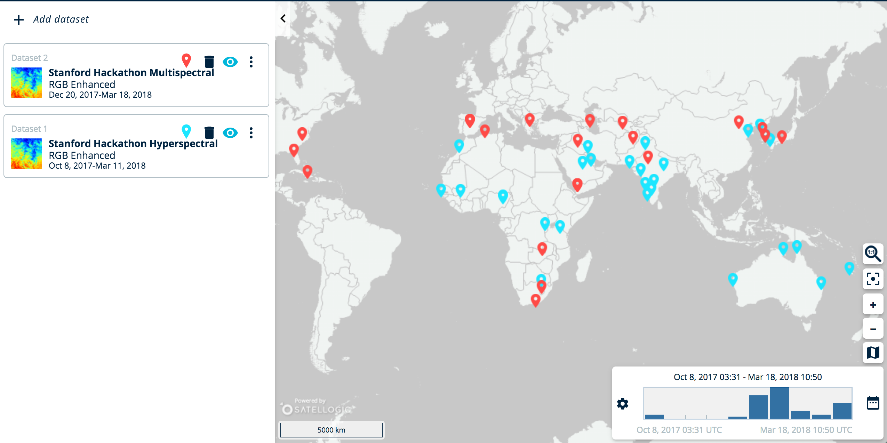
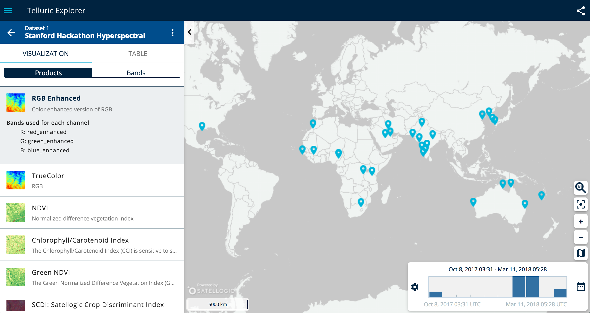
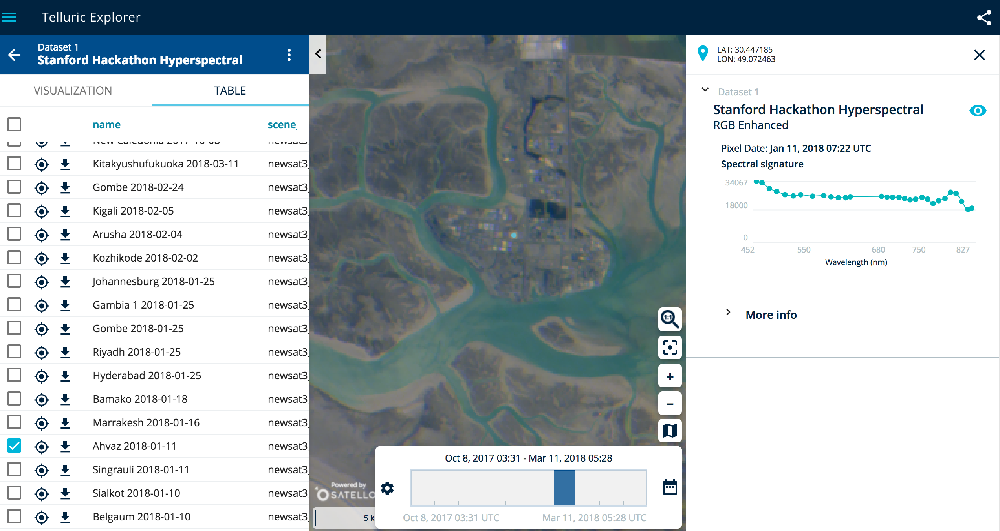

# Accessing data

Across all projects, one of the common needs is to access the satellite data. This document explains how to find imagery data, and download it.


## Satellogic Data

There are 2 ways to get Satellogic data:

* Via the web interfacte on [Telluric/catalog](http://telluric.satellogic.com/catalog).
* Via the Telluric API interfacte on [Telluric](https://telluric.satellogic.com/docs/).
    * On the API you can request of a zipped file for download (might take a few minutes), or you can get each raster directly without delay.

### Via web interface

You should have received a user/password (if not, email brunosan@satellogic.com).

Once loged-in, you can choose to explore the multispectral dataset (RGBA 1 meter resolution), or the hyperspectral dataset (30 bands, 30 meters resolution).



The Explorer allows to give an overview of the locations available within the account dataset. When you zoom in, you can choose a product type to visualize (RGB, NDVI, ...)



Clicking on the list tab, you can navigate directly to any scene, download the corresponding tiff raster files directly, and see the spectral profile for each pixel.




### Via API

First we need to authenticate:

```python
#Authenticate on telluric
import requests
url = 'https://auth.telluric.satellogic.com/api-token-auth/'
payload = {'username':'stanfordhackathon','password':'******'}

print("Getting token...")
r = requests.post(url, data=payload)
if r.status_code != 200:
    raise ValueError("Telluric response error: %s" %r.text)
telluric_token="JWT "+r.json()['token']
print(telluric_token[0:10]+"*masked*")
```

Then we can, for example, search for scences intersecting a point:

```python
#get scene id
import json

# https://telluric.satellogic.com/docs/#operation/list
url = 'https://telluric.satellogic.com/v2/scenes/'

footprint ={
        "type": "Point",
        "coordinates": [
          -16.64703369140625,
          13.447059093856021
        ]
      }

payload = {'footprint': json.dumps(footprint),
           'productname':'cube'}
header = { 'authorization' : telluric_token}
print("Requesting scene...")
r = requests.get(url, params=payload, headers=header)
if r.status_code != 200:
    raise ValueError("Telluric response error: %s" %r.text)
response=r.json()
scene_id=response['results'][0]['scene_id']
print(scene_id)
```

Once the `scene_id` is identified, we can download a single raster:

```python
#download specific hyperspectral band to a file (<30 s with a good connection)
raster_827 = response['results'][0]['rasters'][1]

url = raster_827['url']
filename = raster_827['file_name']
header = { 'authorization' : telluric_token}
```

This will start the request to create a zip file with all rasters. It saves substantial bandwidth.


```python
#get download id for the whole raster
url = 'https://telluric.satellogic.com/v2/scenes/download/'

scene_id = 'newsat3_macro_cube_257e8052c6d94b72ada0b788173791fa_0_4_3'
header = { 'authorization' : telluric_token}
data = {'scene_id':scene_id,
        'async': 1}  # Important! This will prepare the download in the background for us
print("Requesting download...")
r = requests.get(url, params=data, headers=header)
if r.status_code != 200:
    raise ValueError("Telluric response error: %s" %r.text)
response = r.json()
response  
```

We then need to wait,

```python
import time
#after a while (10 minutes), the download is ready
response=requests.get(r.json()['status_path'], headers=header).json()
print(response['status'],end=': ')
while response['status']=='Creating':
    time.sleep(5)
    response=requests.get(r.json()['status_path'], headers=header).json()
    print("%2.1f%%, "%response['progress'],end="")
print('. Ready to download.')
```

Once done, download and unzip

```python
import os
from zipfile import ZipFile

#download raster to a file (<10 minutes with a good connection)
url = response['download_url']
folder="./data/satellogic/macro/"+scene_id+"/"
if not os.path.exists(folder):
    os.makedirs(folder)
filename = folder+response['filename']
header = { 'authorization' : telluric_token}

# http://docs.python-requests.org/en/master/user/quickstart/#raw-response-content
r = requests.get(url, headers=header, stream=True)
if r.status_code != 200:
    raise ValueError("Telluric response error: %s" %r.text)
print(filename)
with open(filename, 'wb') as fd:
    i=0
    total=int(r.headers.get('content-length'))
    for chunk in r.iter_content(chunk_size=1024):
        fd.write(chunk)
        i+=1
        print("\rDownloading %3.2f%%"%(i*1024./total*100),end='')
print("done")

#unzip the contents

with ZipFile(filename, 'r') as fp:
    fp.extractall(folder)
```


## Landsat Data

You can use, e.g., [`landsat-util`](https://pythonhosted.org/landsat-util/) via API, or via web from e.g. USGS.

Download data from https://earthexplorer.usgs.gov/
