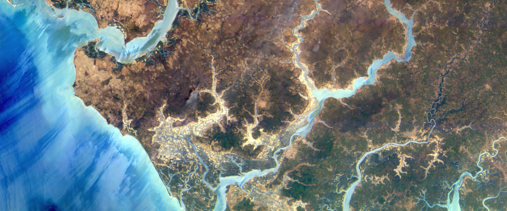
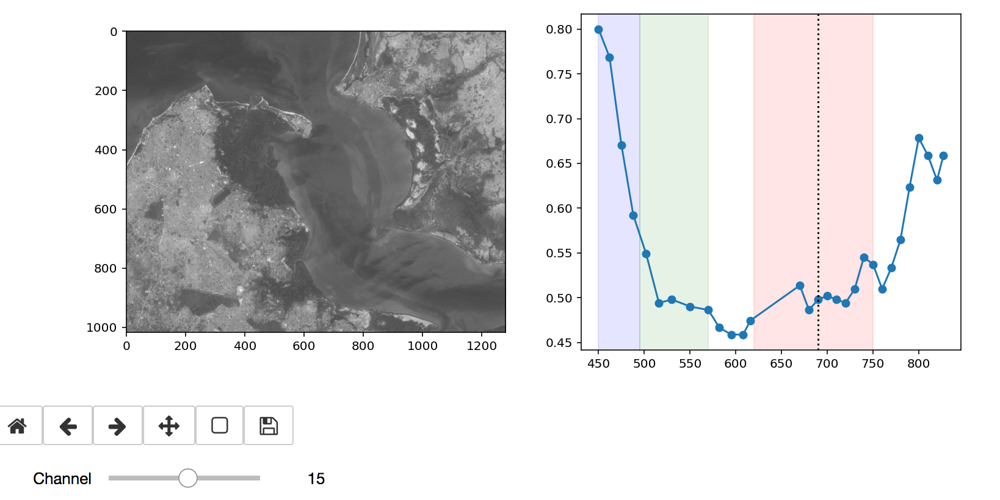

# Open Impact

This repository compiles several ideas for social and/or environmental impact projects using Satellogic data.

Where available, we leverage open software (like python) and open data (like Landsat), as well as Satellogic open data (under the reproducible academic research program, see [license.md](license.md))


Each idea has an explanation at the top, how to read the data, and a few pointers of the tools you might need. This is not an exclusive list, if there's a similar idea wit the same data, feel free to work on it and contribute to the code or ask for help if you have questions. These are just pointers to ignite your curiosity and get you up and running with the basics, like reading a file, as quickly as possible.

## Install

We use conda so we can isolate, and replicate, the working environment across computers. We also use jupyter notebooks running python 3 to explore the data. The following instructions are tested both on MacOS 10.13.3 and Ubuntu 16.04 (Xenial).

To run this notebooks:
* [Install anaconda](https://conda.io/docs/installation.html). `Miniconda` is also OK.
* clone this repository
* Create an environment using the `environment.yml` on this root folder.
    ```sh
    conda env create -f environment.yml
    ```
* Activate the new "satellogic" conda environment.
    ```sh
    source activate satellogic
    python -m ipykernel install --user
    pip install cython
    pip install git+https://github.com/jswhit/pyproj.git
    pip install mapboxgl telluric
    jupyter notebook
    ```

## City fingerprint.

* Can we create a measure that compares cities how the look from space? Could it be used to detect similar cities?
* Could it detect changes of population, if it's a green city, a brick and asphalt city, ...
* Could be use locations where we have information from different instruments, spectral bands and resolution to augment these in other locations where we only have one instrument?
* Could we use Landsat from 5 years ago and today to filter *new construtions* and then try to learn to detect these differences in our hyperspectral data?

Data:
- Geojson list of 200 cities around the world with metadata like population at several times.
- Landsat/Copernicus Level-1 at different times.
- Satellogic Hyperspectral where available.

Concept:

- Cluster the hyperspectral data from many cities into K-means or other algorithms. Force historical data of the same city to be in the same cluster (emphasize permanent information) or in different clusters (emphasize sensitivity to changes in population or other factors).

- Use Open Street Map data to calculate the % content for each satellite pixel (e.g. A landsat pixel might cover 10% park, 20% road, ...). This can be used to predict OSM in unkown places, the pixels with most error might indicate new constructions or features.

[See *Cities* Notebook](cities/Cities.ipynb)


## Gambia

This notebook proposes several ideas using a hyperspectral dataset of [Gambia](https://en.wikipedia.org/wiki/The_Gambia). In Gambia [1/3 of the GDP](https://en.wikipedia.org/wiki/Economy_of_the_Gambia) is agriculture, and about [75% of the population depends on crops](https://rainforests.mongabay.com/deforestation/archive/Gambia.htm).

* Can we identify all villages, cities, crops, marshes, ... and then compare these to known maps?

* Can we identify types of crops of cultivated plots?

* One of the most important aspects in development is access to/from resources. For example access to  hospitals, to schools, to markets... One idea would be identfy access to cultivated plots of land from the villages, or to ports or markets. We could, for example, calculate first the location of planted areas, and then the travel times between these and the closest villages, or port (for exports). This will give us information of the operating cost and effort to produce the harvest, and could help us calculate the impact when a particular road is upgraded, or degraded.


Data:
- Landsat/Copernicus Level-1 at different times.
- Satellogic Hyperspectral where available.

[See Notebook `Gambia` for more details](gambia/Gambia.ipynb)



## Ocean color

This project explores using Satellogic hyperspectral camera for data over the Oceans. Hyperspectral measurements over water bodies can be used to infer important information such as phytoplankton biomass or concentrations of other living and non-living material that modify the characteristics of the incoming radiation.

In this example we show how to download, visualize and cluster hyper data over the coasts of Qatar, Luisiana (USA) and the Southern tip of South Korea.

[See Notebook `Ocean-color` for more details](Ocean-color/Ocean-color.ipynb)
