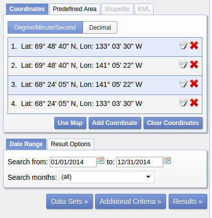
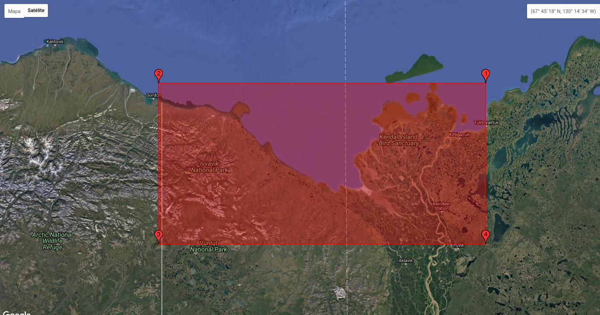
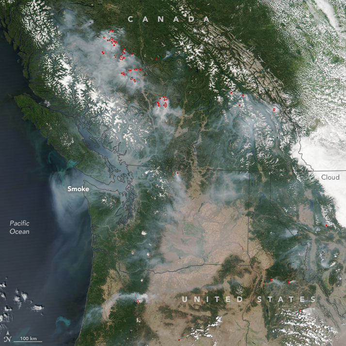
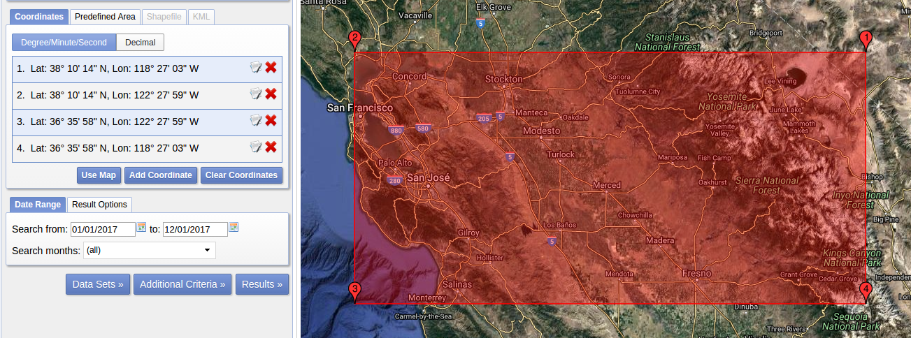

# Forest recovery data

In this document you will find information about hystorical wildfires.

## List of wildfires

This link displays a list of important wildfires: https://en.wikipedia.org/wiki/List_of_wildfires

For selecting the data please take into account the dates of the fires. 
You will use images acquired by the following satellites:

- EO-1 Hyperion: 21 November 2000 	 30 March 2017
- Landsat 5: March 1, 1984 	 June 5, 2013
- Landsat 6: October 5, 1993 	 October 5, 1993
- Landsat 7: April 15, 1999 	 Still active
- Landsat 8: February 11, 2013 	 Still active
- FM3 Satellogic: April 2017 	 Still active 

## 2014 Northwest Territories fires

- Eo-1 Hyperion available data:

Serch criteria:

Date: Search from 01/01/2014 to 12/31/2014

Coordinates:



```sh



```sh

- Landsat available data:

Landsat Collection 1 Level-1:
. Landsat 8
. Landsat 7
. Landsat 4-5

- Satellogic available data = None


## 2017 British Columbia wildfires

Wildfire spots:

[]
```sh

- Eo-1 Hyperions available data:

Until 12-MAR-2017 (Fire was on 06-JUL-2017) 

Serch criteria:

Date: Search from 01/01/2017 to 12/31/2017

Coordinates:

[]
```sh

- Landsat available data:

Landsat Collection 1 Level-1:
. Landsat 8
. Landsat 7
. Landsat 4-5

- Satellogic available data:

Date: 07-OCT-2017  (Fire was on 06-JUL-2017)

https://telluric.satellogic.com/explorer/shared/030d7e29-ec9c-4dcf-8eb3-95de92ef7ce8/automatic_macro_pipeline-RGB_Enhanced-from_2017-04-23_141756-to_2018-01-25_133929