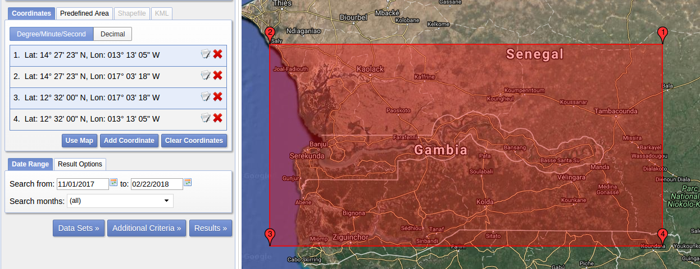

# Gambia Imagery data

This document explains how to find imagery data for the Gambia challenge.

## Landsat Data

Download data from https://earthexplorer.usgs.gov/

Search from: 2017-11-01 to 2018-02-22

Coordinates: Select ROI with the following instructions

## Satellogic Data

Available datasets:

. Date: 2017-11-30

https://telluric.satellogic.com/explorer/shared/67d126f6-008d-4660-ab5c-790197e3d327/automatic_macro_pipeline-RGB_Enhanced-from_2017-04-23_141756-to_2018-01-25_133929

. Date: 2018-01-25

https://telluric.satellogic.com/explorer/shared/d97a0101-eb61-44f4-b0d6-fd3a1b85531a/automatic_macro_pipeline-RGB_Enhanced-from_2017-04-23_141756-to_2018-01-25_133929
